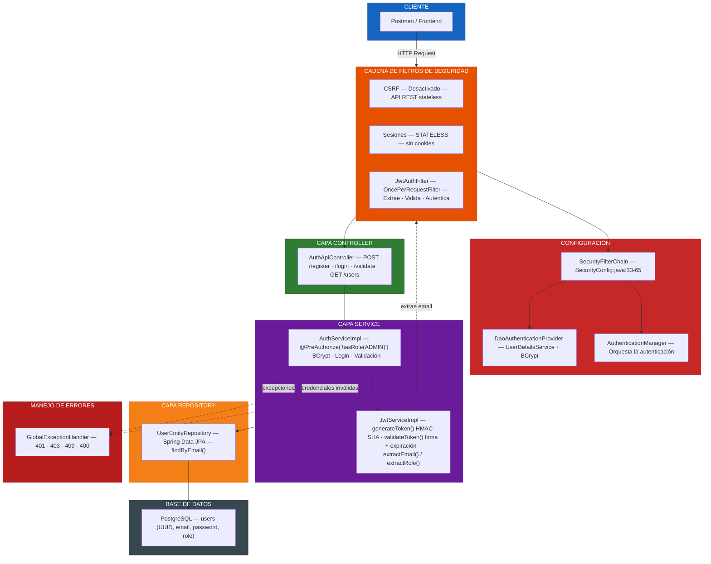
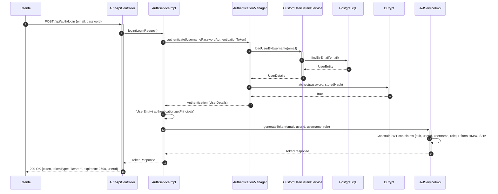
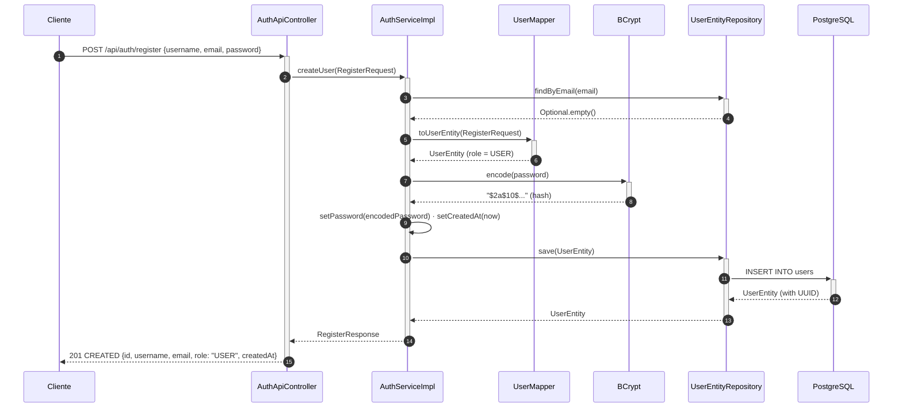
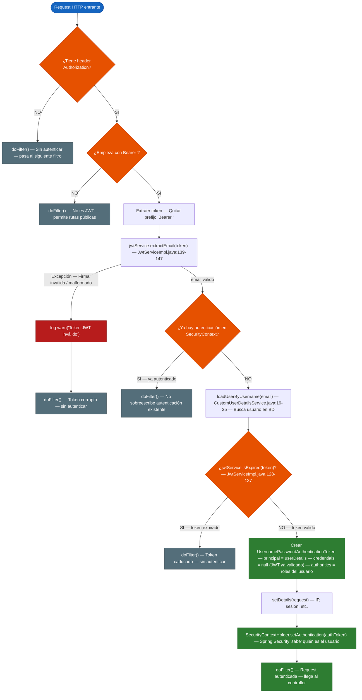
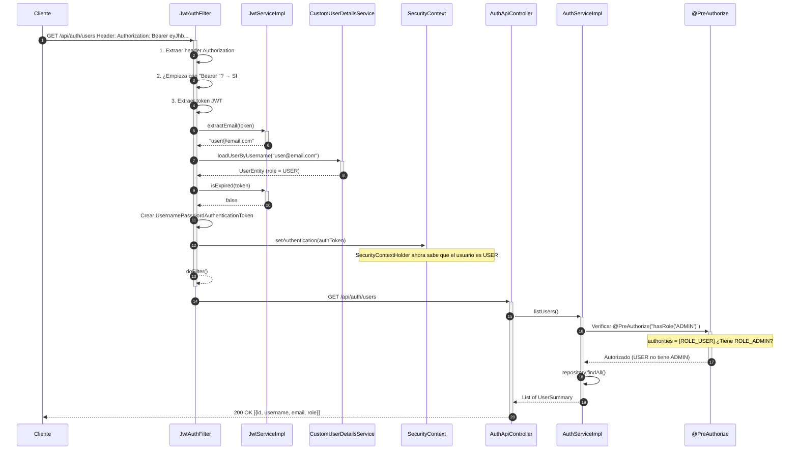
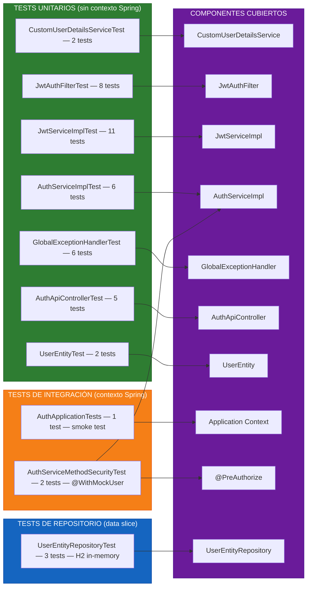
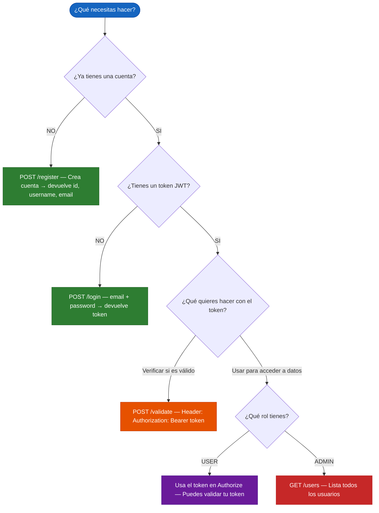
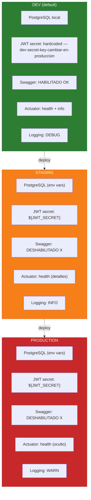

# Arquitectura — Auth API

> Diagramas de la autenticación JWT con Spring Security.
> Cada diagrama referencia las líneas exactas del código fuente.

---

## 1. Arquitectura General

---

## 2. Flujo de Login

> **Flujo de error:** Si las credenciales son incorrectas, `AuthenticationManager` lanza `BadCredentialsException` que `GlobalExceptionHandler` convierte en **401 UNAUTHORIZED** `{error: "INVALID_CREDENTIALS"}`.
>
> **Referencia:** `AuthServiceImpl.java:77-104` · `JwtServiceImpl.java:42-76`

---

## 3. Flujo de Registro

> **Flujo de error:** Si el email ya existe, `findByEmail` devuelve `Optional.of(user)` y el servicio lanza `DuplicateEmailException` que `GlobalExceptionHandler` convierte en **409 CONFLICT** `{error: "USER_ALREADY_EXISTS"}`.
>
> **Referencia:** `AuthServiceImpl.java:44-74` · `UserMapper.java:16` (asigna `UserRole.USER`)

---

## 4. Filtro JWT — Árbol de Decisión

> **Referencia:** `JwtAuthFilter.java:38-98` — Las 8 secciones numeradas del código

---

## 5. Flujo de Autorización (Request Protegido)

> **Flujo de error:** Si el usuario tiene rol USER, `@PreAuthorize` lanza `AccessDeniedException` que `GlobalExceptionHandler` convierte en **403 FORBIDDEN** `{error: "ACCESS_DENIED"}`. Si no tiene token, retorna **401 UNAUTHORIZED**.
>
> **Referencia:** `AuthServiceImpl.java:119-133` · `UserEntity.java:46-48` · `SecurityConfig.java:24`

---

## 6. Mapa de Cobertura de Tests

### Resumen de Cobertura

| Capa | Componente | Tests | Tipo | Total |
|------|-----------|-------|------|-------|
| **Config** | `CustomUserDetailsService` | 2 | Unit | |
| **Config** | `JwtAuthFilter` | 8 | Unit | |
| **Service** | `JwtServiceImpl` | 11 | Unit | |
| **Service** | `AuthServiceImpl` | 6 | Unit | |
| **Service** | `@PreAuthorize` | 2 | Integration | |
| **Controller** | `AuthApiController` | 5 | Unit | |
| **Exception** | `GlobalExceptionHandler` | 6 | Unit | |
| **Entity** | `UserEntity` | 2 | Unit | |
| **Repository** | `UserEntityRepository` | 3 | Slice | |
| **Context** | `AuthApplicationTests` | 1 | Integration | |
| | | | **Total** | **46** |

---

## Endpoints de la API

| Método | Ruta | Autenticación | Descripción |
|--------|------|---------------|-------------|
| `POST` | `/api/auth/register` | Púbica | Crear usuario nuevo |
| `POST` | `/api/auth/login` | Pública | Iniciar sesión → devuelve JWT |
| `POST` | `/api/auth/validate` | Pública | Verificar si un token es válido |
| `GET` | `/api/auth/users` | `@PreAuthorize("hasRole('ADMIN')")` | Listar usuarios |

> **Referencia:** `ApiPaths.java:7-22`

---

## Diagrama de Decisión: ¿Qué endpoint uso?

---

## Configuración por Perfil

> **Referencia:** `application-dev.yaml` · `application-stg.yaml` · `application-prod.yaml`
